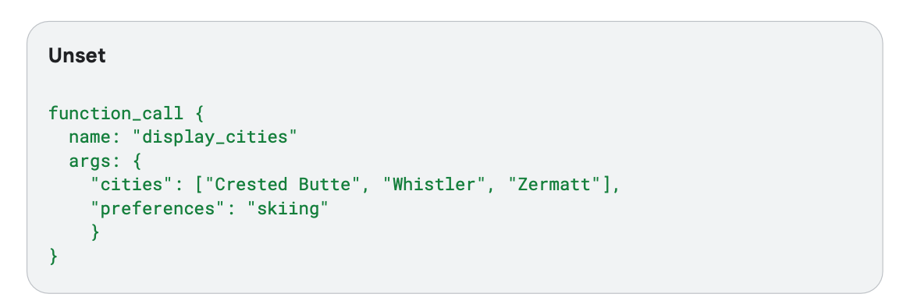
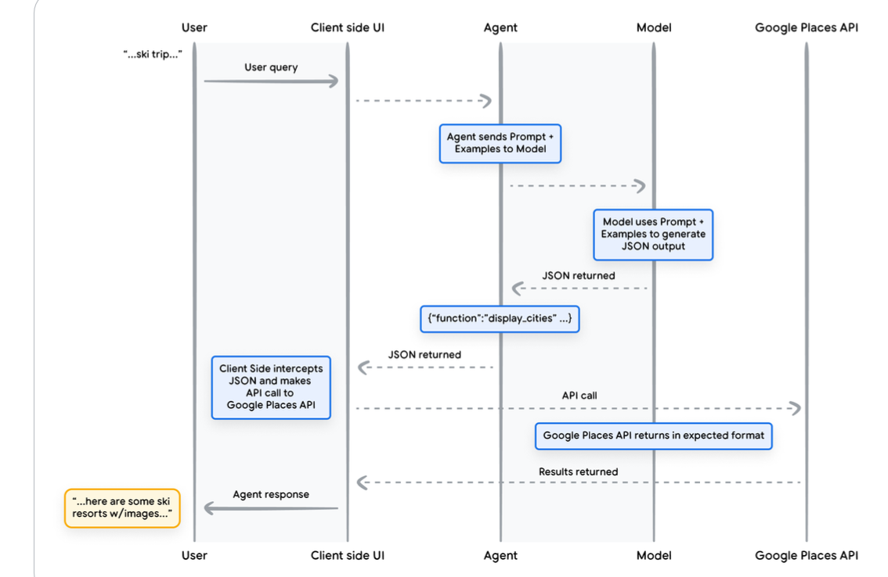

# AI Agents

--------------
 This reading note is a curated summary of papers and blog posts on AI agents. Many texts are directly quoted or adapted from the original sources. The primary goal is to consolidate and summarize key resources on AI agents for easy reference and study. I'll update if new things come.

@Qinyuan Wu, last updation: 2025.01.15

--------------

- [AI Agents](#ai-agents)
  - [What are agents?](#what-are-agents)
  - [How to improve the reasoning/planning ability](#how-to-improve-the-reasoningplanning-ability)
    - [Task decomposition](#task-decomposition)
    - [Self-reflection](#self-reflection)
    - [Cognitive archtecture: memories provide information for reasoning/planning](#cognitive-archtecture-memories-provide-information-for-reasoningplanning)
  - [How to use tools](#how-to-use-tools)
    - [Data stores](#data-stores)
    - [External APIs](#external-apis)
      - [Extensions](#extensions)
      - [Functions](#functions)
    - [Workflows](#workflows)
    - [Others: Model Context Protocol (MCP)](#others-model-context-protocol-mcp)
  - [Environments](#environments)
  - [Enhancing model performance with targeted laerning](#enhancing-model-performance-with-targeted-laerning)
  - [Case study](#case-study)
  - [Resources:](#resources)

--------------

## What are agents? 
What's the difference between AI agents and AI models?

- **Models**: Trained models that will not change the parameters in the environment, including pre-trained LLMs and fine-tuned LLMs. Models will be utilized as the centralized decision maker for agent processes.
- **Workflows**: Systems where LLMs and tools are orchestrated through predefined code paths. Tools bridge the gap between fundational models and the external data and services.
- **Agent**: Systems where LLMs dynamically direct their own processes and tool usage, maintaining control over how they accomplish tasks.

  
  
<em> Overview of an AI agent, figure from <a href="https://www.anthropic.com/research/building-effective-agents">Building effective agents</a></em>

 Agents can use cognitive architectures to reach their end goals by iteratively processing information, making informed decisions, and refining next actions
based on previous outputs. 

1. The first key point in the loop is **how to enable the LLM's reasoning capabilities** to make a good decision.
   a. *Task decomposition*: some prompt engineering framework can help here like chain-of-thought (CoT) and tree-of-thought (ToT). 
   b. *Self-reflection*: allow autonomous sgents to improve iteratively by refining past action decisions and correcting previous mistakes.

2. The second key point in the loop is how to make sure the decision maker LLM **uses right tools**.

3. The third key point in the loop is how to give the **good feedback** from the environment and how to decide to stop from the loop.

## How to improve the reasoning/planning ability

### Task decomposition

1. [Chain of thought](https://arxiv.org/abs/2201.11903) has become a standard prompting technique for enhancing model performance on complex tasks. The model is instructed to “think step by step” to utilize more test-time computation to decompose hard tasks into smaller and simpler steps. CoT transforms big tasks into multiple manageable tasks and shed lights into an interpretation of the model’s thinking process.
2. [Tree of Thoughts](https://arxiv.org/abs/2305.10601) extends CoT by exploring multiple reasoning possibilities at each step. It first decomposes the problem into multiple thought steps and generates multiple thoughts per step, creating a tree structure. The search process can be BFS (breadth-first search) or DFS (depth-first search) with each state evaluated by a classifier (via a prompt) or majority vote.

### Self-reflection
1. [ReAct](https://arxiv.org/pdf/2210.03629): integrates reasoning and acting within LLM by extending the action space to be a combination of task-specific discrete actions and the language space. The former enables LLM to interact with the environment (e.g. use Wikipedia search API), while the latter prompting LLM to generate reasoning traces in natural language.

  
  
<em>The figure is from <a href="https://arxiv.org/pdf/2210.03629">ReAct: Synergizing Reasoning and Acting in Language Models</a></em>

2. [Reflection](https://arxiv.org/abs/2303.11366) is a framework to equip agents with dynamic memory and self-reflection capabilities to improve reasoning skills. Reflexion has a standard RL setup, in which the reward model provides a simple binary reward and the action space follows the setup in ReAct where the task-specific action space is augmented with language to enable complex reasoning steps.

  
  
<em>The figure is from <a href="https://arxiv.org/abs/2303.11366">Reflexion: Language Agents with Verbal Reinforcement Learning</a></em>

   The heuristic function determines when the trajectory is inefficient or contains hallucination and should be stopped. 

3. [Chain of Hindsight](https://arxiv.org/abs/2302.02676)
4. [Algorithm Distillation](https://arxiv.org/abs/2210.14215)

### Cognitive archtecture: memories provide information for reasoning/planning
How the memory plays its role for the agent's internal reasoning:

  
  
<em>The figure is from <a href="https://arxiv.org/abs/2309.02427">Cognitive Architectures for Language Agents</a></em>

**Memory for agents VS memory in human brain**

The human brain encompasses various types of memory, with its cognitive architecture broadly including the following components:

  
  
<em>The figure is from <a href="https://lilianweng.github.io/posts/2023-06-23-agent/">Lil's log: LLM Powered Autonomous Agents</a></em>

1. **Sensory memory** as **learning embedding representations** for raw inputs, including text, image or other modalities;
2. **Short-term memory** as **in-context learning**. It is short and finite, as it is restricted by the finite context window length of Transformer. The reasoning is limited by the context window.
3. **Long-term memory** as the **external vector store** that the agent can attend to at query time, accessible via fast retrieval.

Some works proposed we should have a cognitive architecture for an agent should align with human brain's cognitive architecture.

  
  
<em>The figure is from <a href="https://arxiv.org/abs/2309.02427">Cognitive Architectures for Language Agents</a></em>

## How to use tools

### Data stores

Data stores convert the incoming document into a set of vector database embeddings that the agent can use to extract information it needs to supplement its next action or response to the user.
The key point is to store data in the form of vector embeddings. One of the most common application is the RAG based applications. For different kinds of data, the agent can have different kinds of data store. 

  
  
<em>The figure is from <a href="https://www.kaggle.com/whitepaper-agents">Google White Book: Agents</a></em>

### External APIs

1. The designer should carefully design toolsets and their documentation clearly and thoughtfully. Tool definitions and specifications should be given just as much prompt engineering attention as your overall prompts. 

   Interesting prompt engineering suggestions from [Building effective agents](https://www.anthropic.com/research/building-effective-agents):

   >1. Give the model enough tokens to "think" before it writes itself into a corner.
   >2. Keep the format close to what the model has seen naturally occurring in text on the internet.
   >3. Make sure there's no formatting "overhead" such as having to keep an accurate count of thousands of lines of code, or string-escaping any code it writes.

2. Enhancing model performance with targeted learning -- we will talk about it in the next section.

#### Extensions

An extension bridges the gap between an agent and an API by:
1. Teaching the agent how to use the API endpoint using examples.
2. Teaching the agent what arguments or parameters are needed to successfully call the API endpoint.

  
  
<em>The figure is from <a href="https://www.kaggle.com/whitepaper-agents">Google White Book: Agents</a></em>

#### Functions

The agent developer might not want the LLM to manage the API execution (extensions) because of security or additional data transformation logic needs to be applied to the API response. So we want the model can be used to invoke **functions** in order to handle complex, client-side execution flows for the end user.

A typical conversation when the user ask for a ski trip suggestion:

While the above output contains the data that we need (city names), the format isn’t ideal for parsing. With Function Calling, we can teach a model to format this output in a structured style (like JSON) that’s more convenient for another system to parse. 

This JSON format output can help the model to use the external API better:

One key thing to remember about functions is that they are meant to offer the developer much more control over not only the execution of API calls, but also the entire flow of data in the application as a whole. 

### Workflows

Now we know how to build external data stores and how to use external APIs, the key part to use them in an Agent system is to build your own workflows used LLMs and those tools. Here are some abstractions of workflows.

All those figures in workflows are coming from  [Abtriouc: Building effective agents](https://www.anthropic.com/research/building-effective-agents)

1. Prompt chaining, the gate can me programmatic checks.

  
  
<em>Figure 1: Routing</em>

  
  
<em>Figure 2: Parallelization</em>

  
  
<em>Figure 3: Orchestrator-workers</em>

  
  
<em>Figure 4: Evaluator-optimizer</em>

  
  
<em>Figure 5: Alt Text for Image 5</em>

### Others: [Model Context Protocol (MCP)](https://www.anthropic.com/news/model-context-protocol)
**Make sure safe connection with external sources.**
 A new standard for connecting AI assistants to the systems where data lives, including content repositories, business tools, and development environments. Its aim is to help frontier models produce better, more relevant responses.

## Environments

 This effectively simplifies the agent’s interaction with the outside world as a “text game” with textual observations and actions.

1. **Physical Environments**: These involve AI interacting with the physical world using perceptual inputs (e.g., visual, audio, tactile) converted into text, and robotic planners executing language-based commands. Recent advancements in LLMs have enabled robots to act as "brains" for physical interactions, integrating vision-language models to generate actions or plans.

2. **Dialogue with Humans or Other Agents**: This focuses on linguistic interactions, where agents take instructions, seek clarifications, or assist in tasks. Research also explores multi-agent interactions for tasks like social simulations, debates, and collaborative problem-solving.

3. **Digital Environments**: AI interacts with digital platforms like APIs, websites, and virtual tools. This environment is cost-effective and serves as a testbed for tasks like external knowledge augmentation and computation, making it particularly useful for NLP applications.

## Enhancing model performance with targeted laerning
To help the model gain access to this type of specific knowledge about which tools it should select, here are some strategies:
1. In-context learning (example: ReAct framework): provide few-shot examples at inference.
2. Retrieval-based in-context learning: dynamically populates the model prompt with the most relevant information, tools, and associated examples by retrieving them from external memory.
3. Fine-tuning based learning: training a model using a larger dataset of specific examples prior to inference.

## Case study

[Agent laboratory: using LLM agents as research assistants](https://agentlaboratory.github.io/)

[ResearchTown: Simulator of Human Research Community](https://arxiv.org/abs/2412.17767)
   
<!-- ## Related Research Questions
1. Instructions hierarchy: which instruction the generative model should follow?
2. Knowledge hierarchy: the knowledge is from different resources (parametric knowledge, RAG knowledge, user's instruction knowledge), which one the model should follow? Should we decide the priority or we can use another LLM to decide the priority? -->

----------
## Resources:

*The resources list is generated by ChatGPT.* :)

- Research Papers
  - [Chain of Thought Prompting](https://arxiv.org/abs/2201.11903)
  - [Tree of Thoughts](https://arxiv.org/abs/2305.10601)
  - [ReAct](https://arxiv.org/pdf/2210.03629)
  - [Reflexion](https://arxiv.org/abs/2303.11366)  
  - [Chain of Hindsight](https://arxiv.org/abs/2302.02676) 
  - [Algorithm Distillation](https://arxiv.org/abs/2210.14215)
  - [Cognitive Architectures for Language Agents](https://arxiv.org/abs/2309.02427)  

- Blog Posts and Reports
  - [Lil's Log: LLM Powered Autonomous Agents](https://lilianweng.github.io/posts/2023-06-23-agent/)
  - [Building Effective Agents](https://www.anthropic.com/research/building-effective-agents)
  - [Agents](Agents)
  - [Prompt Engineering Guide](https://www.promptingguide.ai/research/llm-agents)
